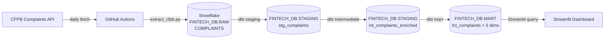
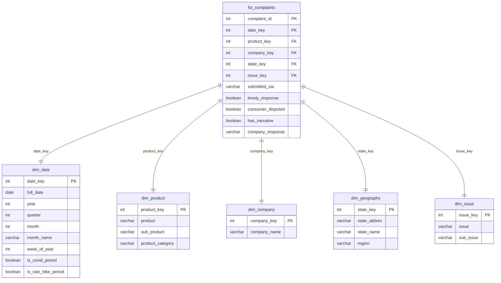

# Financial Services Lead Gen Analytics

**Course:** ISBA 4715 — Analytics Engineering &nbsp;|&nbsp; **Student:** Eliza Okome  
**Target Role:** Junior Data Analyst @ EPCVIP, Inc.

**Business Question:** Which financial products and markets have the highest consumer dissatisfaction (as measured by CFPB complaints), and how can a lead generation company use that signal to guide campaign targeting?

## Pipeline



## Star Schema (ERD)



## Setup

### Prerequisites

- Python 3.11+
- Snowflake account
- `pip install dbt-snowflake`

### Local Development

1. Copy env template and fill in credentials:
   ```bash
   cp .env.example .env
   # edit .env with your Snowflake credentials
   ```

2. Install Python dependencies:
   ```bash
   pip install -r extract/requirements.txt
   ```

3. Run the extract:
   ```bash
   python extract/extract_cfpb.py
   ```

4. Run dbt (profiles.yml reads credentials from `.env` via `env_var()`):
   ```bash
   cd dbt
   dbt run --profiles-dir .
   dbt test --profiles-dir .
   ```

### GitHub Actions (CI/CD)

Add the following secrets in **GitHub → Settings → Secrets and variables → Actions**:

| Secret | Value |
|---|---|
| `SNOWFLAKE_ACCOUNT` | `VXBOMAL-QGC80885` |
| `SNOWFLAKE_USER` | your Snowflake username |
| `SNOWFLAKE_PASSWORD` | your Snowflake password |
| `SNOWFLAKE_WAREHOUSE` | `COMPUTE_WH` |
| `SNOWFLAKE_DATABASE` | `FINTECH_DB` |
| `SNOWFLAKE_ROLE` | `ACCOUNTADMIN` |

The workflow runs daily at 6:00 AM UTC and can be triggered manually from the **Actions** tab.

## Data Source

**CFPB Consumer Complaints Database**  
- API: `https://api.consumerfinance.gov/data/complaints`  
- Date range: 2020-01-01 to present  
- Estimated volume: 3–4 million complaints

## Tech Stack

| Layer | Tool |
|---|---|
| Data Warehouse | Snowflake (AWS US East 1) |
| Transformation | dbt-snowflake |
| Orchestration | GitHub Actions |
| Dashboard | Streamlit (Milestone 02) |
| Version Control | Git + GitHub |
