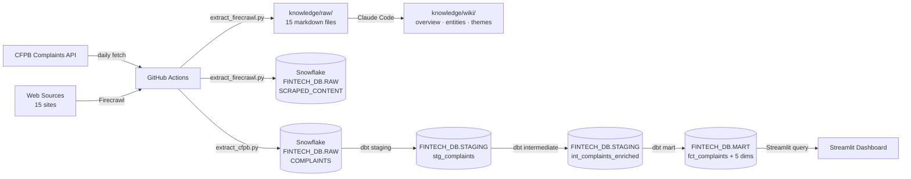
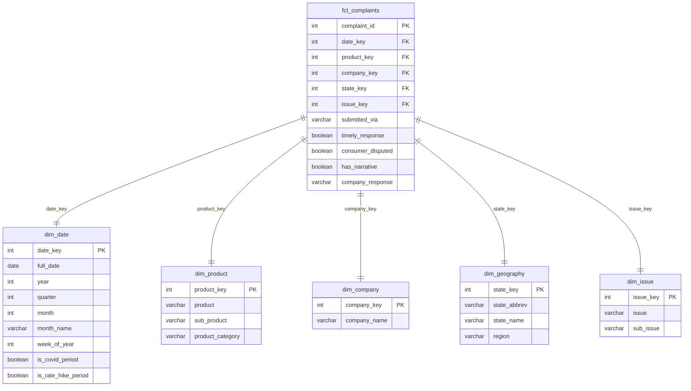
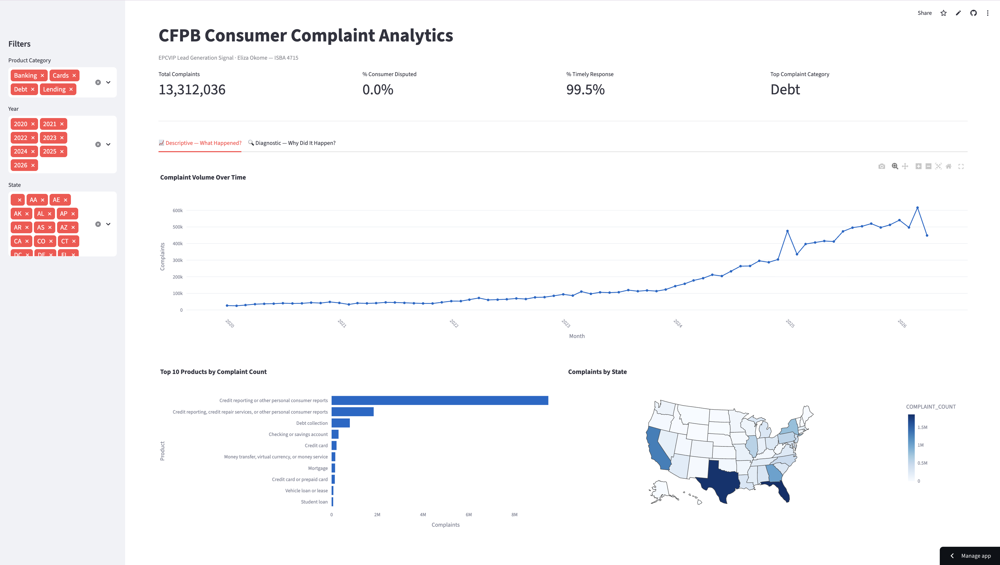
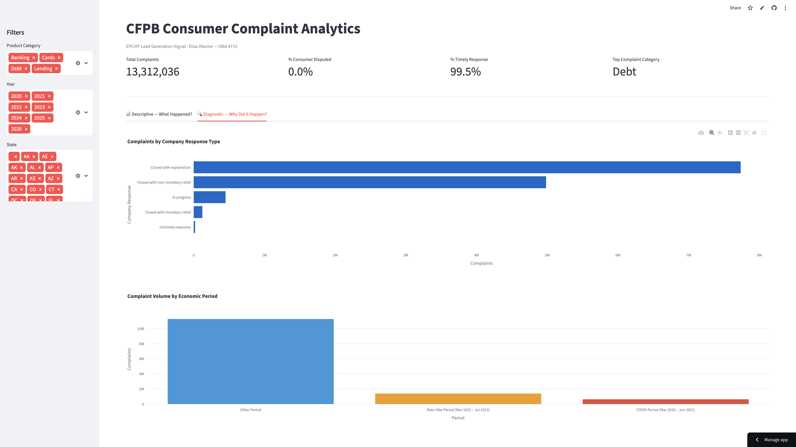

# Financial Services Lead Gen Analytics

This project addresses a core business question for financial services lead generation: which products and markets have the highest consumer dissatisfaction, and how can those signals guide campaign targeting? It ingests 3–4 million CFPB consumer complaints via REST API into Snowflake, transforms them through a dbt star schema, and delivers a live Streamlit dashboard showing complaint trends by product, company, geography, and time period. A Claude Code-curated knowledge base synthesizes 15 scraped sources — CFPB data pages, regulatory sites, and industry analysis — into actionable wiki pages on the complaint landscape.

## Job Posting

- **Role:** Junior Data Analyst
- **Company:** EPCVIP, Inc.
- **Link:** `docs/job-posting.pdf`

This project demonstrates every skill the role requires: SQL-based data transformation (dbt), automated pipelines (GitHub Actions), dashboard delivery (Streamlit), data accuracy via dbt tests, and campaign performance framing — all applied directly to EPCVIP's core business of financial services lead generation.

## Tech Stack

| Layer | Tool |
|---|---|
| Source 1 | CFPB Consumer Complaints REST API |
| Source 2 | Web scrape via Firecrawl (15 sources → `knowledge/raw/`) |
| Data Warehouse | Snowflake (AWS US East 1) |
| Transformation | dbt-snowflake |
| Orchestration | GitHub Actions (daily at 6:00 AM UTC) |
| Dashboard | [Streamlit Community Cloud](https://data-analyst-fintech-nshk8gbcxpwzd2tcwwwypb.streamlit.app/) |
| Knowledge Base | Claude Code (scrape → summarize → query) |
| Version Control | Git + GitHub |

## Pipeline Diagram



## ERD (Star Schema)



## Dashboard Preview

**Descriptive Analytics**


**Diagnostic Analytics**


## Key Insights

**Descriptive (what happened?):** Credit card complaints surged 67% in 2024 as average APRs hit a record 25.2%, while credit reporting errors dominated overall volume at 80%+ of all FY2023 complaints.

**Diagnostic (why did it happen?):** Federal Reserve rate hikes drove payment shock across adjustable-rate products; simultaneously, credit bureaus failed to correct errors at scale, generating structural complaint volume independent of economic cycles.

**Recommendation:** Prioritize credit card and mortgage refinance campaigns in states with above-average complaint rates → target consumers actively experiencing product failure, who have the highest intent to switch.

## Live Dashboard

**URL:** [data-analyst-fintech-nshk8gbcxpwzd2tcwwwypb.streamlit.app](https://data-analyst-fintech-nshk8gbcxpwzd2tcwwwypb.streamlit.app/)

## Knowledge Base

A Claude Code-curated wiki built from 15 scraped sources spanning the CFPB, Federal Reserve, FTC, EPCVIP, Bankrate, NerdWallet, Investopedia, and TheBalance. Wiki pages live in `knowledge/wiki/`, raw sources in `knowledge/raw/`. Browse `knowledge/index.md` to see all pages.

**Query it:** Open Claude Code in this repo and ask questions like:

- "Which financial products have the highest complaint rates and what does that mean for lead gen targeting?"
- "What do the sources say about geographic patterns in CFPB complaints?"
- "How does EPCVIP's business model connect to consumer complaint signals?"

Claude Code reads the wiki pages first and falls back to raw sources when needed. See `CLAUDE.md` for the query conventions.

## Setup & Reproduction

**Prerequisites:** Python 3.11+, Snowflake account, `pip install dbt-snowflake`

Copy `.env.example` to `.env` and fill in your credentials:

    SNOWFLAKE_ACCOUNT=
    SNOWFLAKE_USER=
    SNOWFLAKE_PASSWORD=
    SNOWFLAKE_DATABASE=FINTECH_DB
    SNOWFLAKE_SCHEMA=RAW
    SNOWFLAKE_WAREHOUSE=COMPUTE_WH
    SNOWFLAKE_ROLE=ACCOUNTADMIN
    FIRECRAWL_API_KEY=

Install dependencies and run the pipeline:

```bash
pip install -r extract/requirements.txt
python extract/extract_cfpb.py

cd dbt
dbt run --profiles-dir .
dbt test --profiles-dir .
```

**GitHub Actions:** Add the Snowflake variables above as repository secrets. The workflow runs daily at 6:00 AM UTC and can be triggered manually from the **Actions** tab.

## Repository Structure

    .
    ├── .github/workflows/    # GitHub Actions pipeline (daily CFPB extract + dbt run)
    ├── extract/              # Python extraction scripts (CFPB API + Firecrawl scrape)
    ├── dbt/                  # dbt models and tests (staging → intermediate → mart)
    ├── dashboard/            # Streamlit app
    ├── knowledge/            # Knowledge base
    │   ├── raw/              # 15 scraped source files
    │   ├── wiki/             # 3 Claude Code-synthesized wiki pages
    │   └── index.md          # Index of all pages with summaries
    ├── docs/                 # Proposal and job posting
    ├── .env.example          # Required environment variables
    ├── .gitignore
    ├── CLAUDE.md             # Project context for Claude Code
    └── README.md             # This file
