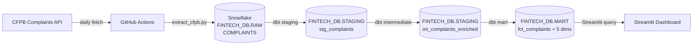
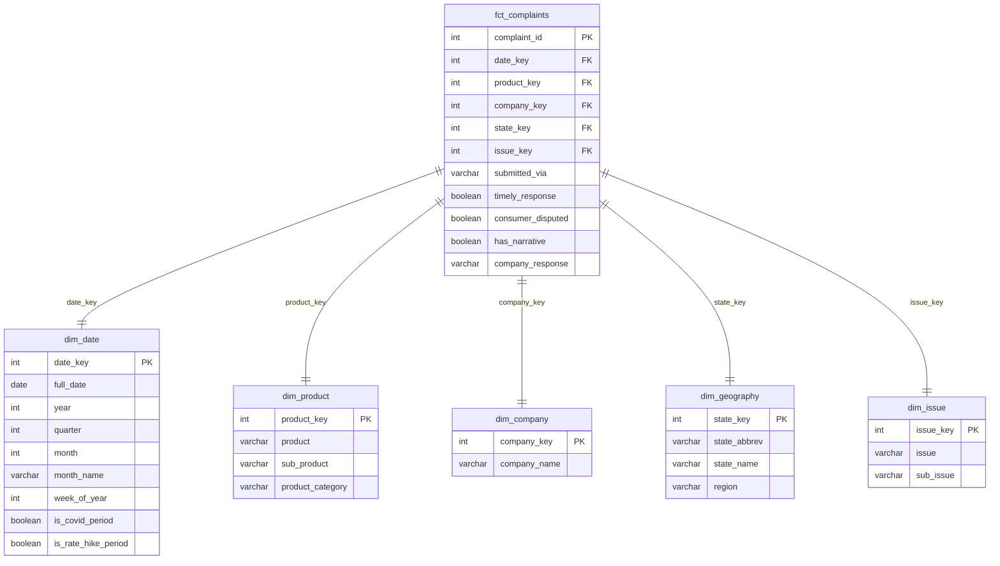

# Milestone 01: Extract, Load & Transform Implementation Plan

> **For agentic workers:** REQUIRED SUB-SKILL: Use superpowers:subagent-driven-development (recommended) or superpowers:executing-plans to implement this plan task-by-task. Steps use checkbox (`- [ ]`) syntax for tracking.

**Goal:** Build the end-to-end pipeline from CFPB API → Snowflake RAW → dbt Staging/Intermediate/Mart, wired up to run daily via GitHub Actions.

**Architecture:** A Python script fetches CFPB complaints using daily date-windowed API calls (avoids Elasticsearch's 10K offset limit) and bulk-loads to Snowflake. dbt transforms through staging (type-cast + rename), intermediate (add `product_category`), and mart (star schema) layers. GitHub Actions orchestrates both steps on a daily cron.

**Tech Stack:** Python 3.11, snowflake-connector-python, requests, python-dotenv, dbt-snowflake, GitHub Actions

---

## File Map

**Create:**
- `.env.example`
- `extract/requirements.txt`
- `extract/extract_cfpb.py`
- `extract/tests/test_extract.py`
- `dbt/dbt_project.yml`
- `dbt/profiles.yml` ← gitignored
- `dbt/macros/generate_schema_name.sql`
- `dbt/models/staging/_sources.yml`
- `dbt/models/staging/_staging.yml`
- `dbt/models/staging/stg_complaints.sql`
- `dbt/models/intermediate/_intermediate.yml`
- `dbt/models/intermediate/int_complaints_enriched.sql`
- `dbt/models/mart/dim_date.sql`
- `dbt/models/mart/dim_product.sql`
- `dbt/models/mart/dim_company.sql`
- `dbt/models/mart/dim_geography.sql`
- `dbt/models/mart/dim_issue.sql`
- `dbt/models/mart/fct_complaints.sql`
- `dbt/models/mart/_mart.yml`
- `.github/workflows/extract.yml`
- `README.md`

**Verify (no change needed):**
- `.gitignore` — already contains `.env` (line 139) and `profiles.yml` (line 221), which covers `dbt/profiles.yml`

---

### Task 1: Infrastructure — .env.example and requirements.txt

**Files:**
- Create: `.env.example`
- Create: `extract/requirements.txt`

- [ ] **Step 1: Create `.env.example`**

```
SNOWFLAKE_ACCOUNT=VXBOMAL-QGC80885
SNOWFLAKE_USER=your_username
SNOWFLAKE_PASSWORD=your_password_here
SNOWFLAKE_WAREHOUSE=COMPUTE_WH
SNOWFLAKE_DATABASE=FINTECH_DB
SNOWFLAKE_ROLE=ACCOUNTADMIN
SNOWFLAKE_SCHEMA=RAW
```

- [ ] **Step 2: Create `extract/requirements.txt`**

```
requests==2.32.3
pandas==2.2.3
snowflake-connector-python[pandas]==3.12.3
python-dotenv==1.0.1
```

- [ ] **Step 3: Commit**

```bash
git add .env.example extract/requirements.txt
git commit -m "feat: add env template and extract dependencies"
```

---

### Task 2: CFPB Extract Script

**Files:**
- Create: `extract/tests/test_extract.py`
- Create: `extract/extract_cfpb.py`

**Background:** The CFPB API is backed by Elasticsearch which limits `from + size` to 10,000. A single month can have ~40K complaints, so monthly pagination would silently truncate. Daily windows average ~1,300 complaints — safely under 5,000 per page. The script fetches day-by-day and flushes to Snowflake in 80K-row batches to reduce round trips.

- [ ] **Step 1: Write the failing test for `hits_to_df`**

```python
# extract/tests/test_extract.py
import sys, os
sys.path.insert(0, os.path.join(os.path.dirname(__file__), ".."))

from extract_cfpb import hits_to_df, COLUMNS


def test_hits_to_df_maps_api_fields():
    hits = [{"complaint_id": "123", "product": "Mortgage", "state": "CA"}]
    df = hits_to_df(hits)
    assert list(df.columns) == COLUMNS
    assert df["COMPLAINT_ID"].iloc[0] == "123"
    assert df["PRODUCT"].iloc[0] == "Mortgage"
    assert df["STATE"].iloc[0] == "CA"


def test_hits_to_df_coerces_missing_to_empty_string():
    hits = [{"complaint_id": "456"}]
    df = hits_to_df(hits)
    assert df["PRODUCT"].iloc[0] == ""
    assert df["STATE"].iloc[0] == ""


def test_hits_to_df_coerces_none_to_empty_string():
    hits = [{"complaint_id": "789", "product": None, "state": None}]
    df = hits_to_df(hits)
    assert df["PRODUCT"].iloc[0] == ""
    assert df["STATE"].iloc[0] == ""
```

- [ ] **Step 2: Run test to verify it fails**

```bash
cd /Users/elizaokome/isba-4715/data-analyst-fintech
pip install -r extract/requirements.txt pytest
pytest extract/tests/test_extract.py -v
```

Expected: `ModuleNotFoundError: No module named 'extract_cfpb'`

- [ ] **Step 3: Create `extract/extract_cfpb.py`**

```python
#!/usr/bin/env python3
import os
import logging
from datetime import date, timedelta
from typing import Iterator

import requests
import pandas as pd
import snowflake.connector
from snowflake.connector.pandas_tools import write_pandas
from dotenv import load_dotenv

load_dotenv()
logging.basicConfig(level=logging.INFO, format="%(asctime)s %(levelname)s %(message)s")
log = logging.getLogger(__name__)

CFPB_URL     = "https://api.consumerfinance.gov/data/complaints"
PAGE_SIZE    = 5000
INITIAL_DATE = date(2020, 1, 1)
FLUSH_AT     = 80_000  # rows to accumulate before writing to Snowflake

COLUMNS = [
    "COMPLAINT_ID", "DATE_RECEIVED", "PRODUCT", "SUB_PRODUCT",
    "ISSUE", "SUB_ISSUE", "CONSUMER_COMPLAINT_NARRATIVE",
    "COMPANY_PUBLIC_RESPONSE", "COMPANY", "STATE", "ZIP_CODE", "TAGS",
    "CONSUMER_CONSENT_PROVIDED", "SUBMITTED_VIA", "DATE_SENT_TO_COMPANY",
    "COMPANY_RESPONSE_TO_CONSUMER", "TIMELY_RESPONSE", "CONSUMER_DISPUTED",
]

_FIELD_MAP = {
    "COMPLAINT_ID":                 "complaint_id",
    "DATE_RECEIVED":                "date_received",
    "PRODUCT":                      "product",
    "SUB_PRODUCT":                  "sub_product",
    "ISSUE":                        "issue",
    "SUB_ISSUE":                    "sub_issue",
    "CONSUMER_COMPLAINT_NARRATIVE": "consumer_complaint_narrative",
    "COMPANY_PUBLIC_RESPONSE":      "company_public_response",
    "COMPANY":                      "company",
    "STATE":                        "state",
    "ZIP_CODE":                     "zip_code",
    "TAGS":                         "tags",
    "CONSUMER_CONSENT_PROVIDED":    "consumer_consent_provided",
    "SUBMITTED_VIA":                "submitted_via",
    "DATE_SENT_TO_COMPANY":         "date_sent_to_company",
    "COMPANY_RESPONSE_TO_CONSUMER": "company_response_to_consumer",
    "TIMELY_RESPONSE":              "timely_response",
    "CONSUMER_DISPUTED":            "consumer_disputed",
}

DATABASE = os.environ["SNOWFLAKE_DATABASE"]
SCHEMA   = os.environ["SNOWFLAKE_SCHEMA"]
TABLE    = "COMPLAINTS"

_CREATE_DB     = f"CREATE DATABASE IF NOT EXISTS {DATABASE}"
_CREATE_SCHEMA = f"CREATE SCHEMA IF NOT EXISTS {DATABASE}.{SCHEMA}"
_CREATE_TABLE  = f"""
CREATE TABLE IF NOT EXISTS {DATABASE}.{SCHEMA}.{TABLE} (
    COMPLAINT_ID                  VARCHAR,
    DATE_RECEIVED                 VARCHAR,
    PRODUCT                       VARCHAR,
    SUB_PRODUCT                   VARCHAR,
    ISSUE                         VARCHAR,
    SUB_ISSUE                     VARCHAR,
    CONSUMER_COMPLAINT_NARRATIVE  VARCHAR,
    COMPANY_PUBLIC_RESPONSE       VARCHAR,
    COMPANY                       VARCHAR,
    STATE                         VARCHAR,
    ZIP_CODE                      VARCHAR,
    TAGS                          VARCHAR,
    CONSUMER_CONSENT_PROVIDED     VARCHAR,
    SUBMITTED_VIA                 VARCHAR,
    DATE_SENT_TO_COMPANY          VARCHAR,
    COMPANY_RESPONSE_TO_CONSUMER  VARCHAR,
    TIMELY_RESPONSE               VARCHAR,
    CONSUMER_DISPUTED             VARCHAR
)
"""


def hits_to_df(hits: list[dict]) -> pd.DataFrame:
    rows = [
        {col: str(h.get(api_key) or "") for col, api_key in _FIELD_MAP.items()}
        for h in hits
    ]
    return pd.DataFrame(rows, columns=COLUMNS)


def _fetch_window(
    session: requests.Session, start: date, end: date
) -> Iterator[list[dict]]:
    frm = 0
    while True:
        params = {
            "date_received_min": str(start),
            "date_received_max": str(end),
            "size":              PAGE_SIZE,
            "frm":               frm,
            "format":            "json",
        }
        resp = session.get(CFPB_URL, params=params, timeout=60)
        resp.raise_for_status()
        hits = resp.json()["hits"]["hits"]
        if not hits:
            break
        yield [h["_source"] for h in hits]
        if len(hits) < PAGE_SIZE:
            break
        frm += PAGE_SIZE


def _get_load_start(conn: snowflake.connector.SnowflakeConnection) -> date:
    cur = conn.cursor()
    try:
        cur.execute(f"SELECT MAX(DATE_RECEIVED) FROM {DATABASE}.{SCHEMA}.{TABLE}")
        row = cur.fetchone()
        if row and row[0]:
            return date.fromisoformat(str(row[0])) - timedelta(days=7)
        return INITIAL_DATE
    except Exception:
        return INITIAL_DATE
    finally:
        cur.close()


def _setup(conn: snowflake.connector.SnowflakeConnection) -> None:
    cur = conn.cursor()
    cur.execute(_CREATE_DB)
    cur.execute(_CREATE_SCHEMA)
    cur.execute(_CREATE_TABLE)
    cur.close()


def main() -> None:
    conn = snowflake.connector.connect(
        account=os.environ["SNOWFLAKE_ACCOUNT"],
        user=os.environ["SNOWFLAKE_USER"],
        password=os.environ["SNOWFLAKE_PASSWORD"],
        warehouse=os.environ["SNOWFLAKE_WAREHOUSE"],
        role=os.environ.get("SNOWFLAKE_ROLE", "ACCOUNTADMIN"),
    )
    _setup(conn)

    load_start = _get_load_start(conn)
    load_end   = date.today()
    log.info("Loading %s → %s", load_start, load_end)

    cur = conn.cursor()
    cur.execute(
        f"DELETE FROM {DATABASE}.{SCHEMA}.{TABLE} "
        f"WHERE DATE_RECEIVED >= '{load_start}' AND DATE_RECEIVED <= '{load_end}'"
    )
    cur.close()

    session = requests.Session()
    batch: list[dict] = []
    current = load_start

    while current <= load_end:
        for page in _fetch_window(session, current, current):
            batch.extend(page)
        if len(batch) >= FLUSH_AT or current == load_end:
            if batch:
                df = hits_to_df(batch)
                write_pandas(conn, df, TABLE, database=DATABASE, schema=SCHEMA)
                log.info("Flushed %s rows (through %s)", f"{len(df):,}", current)
                batch = []
        current += timedelta(days=1)

    conn.close()
    log.info("Done.")


if __name__ == "__main__":
    main()
```

- [ ] **Step 4: Run test to verify it passes**

```bash
pytest extract/tests/test_extract.py -v
```

Expected:
```
PASSED extract/tests/test_extract.py::test_hits_to_df_maps_api_fields
PASSED extract/tests/test_extract.py::test_hits_to_df_coerces_missing_to_empty_string
PASSED extract/tests/test_extract.py::test_hits_to_df_coerces_none_to_empty_string
```

- [ ] **Step 5: Commit**

```bash
git add extract/extract_cfpb.py extract/tests/test_extract.py
git commit -m "feat: add CFPB extract script with Snowflake loading"
```

---

### Task 3: dbt Project Config

**Files:**
- Create: `dbt/dbt_project.yml`
- Create: `dbt/profiles.yml` (gitignored — do not `git add` this file)
- Create: `dbt/macros/generate_schema_name.sql`

**Note on schema naming:** dbt's default behavior is to prefix custom schema names with the target schema (e.g., `STAGING_STAGING`). The macro below overrides that so models with `+schema: STAGING` land in exactly `STAGING`, not `STAGING_STAGING`.

- [ ] **Step 1: Create `dbt/dbt_project.yml`**

```yaml
name: 'data_analyst_fintech'
version: '1.0.0'
config-version: 2

profile: 'data_analyst_fintech'

model-paths: ["models"]
test-paths: ["tests"]
seed-paths: ["seeds"]
macro-paths: ["macros"]
clean-targets: ["target", "dbt_packages"]

models:
  data_analyst_fintech:
    staging:
      +materialized: view
      +schema: STAGING
    intermediate:
      +materialized: view
      +schema: STAGING
    mart:
      +materialized: table
      +schema: MART
```

- [ ] **Step 2: Create `dbt/profiles.yml`** (will be gitignored — credentials pulled from `.env` at runtime)

```yaml
data_analyst_fintech:
  target: dev
  outputs:
    dev:
      type: snowflake
      account: "{{ env_var('SNOWFLAKE_ACCOUNT') }}"
      user: "{{ env_var('SNOWFLAKE_USER') }}"
      password: "{{ env_var('SNOWFLAKE_PASSWORD') }}"
      role: "{{ env_var('SNOWFLAKE_ROLE') }}"
      database: "{{ env_var('SNOWFLAKE_DATABASE') }}"
      warehouse: "{{ env_var('SNOWFLAKE_WAREHOUSE') }}"
      schema: STAGING
      threads: 4
      client_session_keep_alive: false
```

- [ ] **Step 3: Create `dbt/macros/generate_schema_name.sql`**

```sql

    
        {{ target.schema | upper }}
    
        {{ custom_schema_name | upper }}
    

```

- [ ] **Step 4: Install dbt and verify config parses**

```bash
pip install dbt-snowflake
cd /Users/elizaokome/isba-4715/data-analyst-fintech/dbt
dbt parse --profiles-dir . 2>&1 | head -30
```

Expected: No YAML or config errors. (A connection error to Snowflake at this stage is fine — we only need the YAML to be valid.)

- [ ] **Step 5: Commit** (profiles.yml excluded because it is gitignored)

```bash
cd /Users/elizaokome/isba-4715/data-analyst-fintech
git add dbt/dbt_project.yml dbt/macros/generate_schema_name.sql
git commit -m "feat: add dbt project config and schema-name macro"
```

---

### Task 4: dbt Staging Layer

**Files:**
- Create: `dbt/models/staging/_sources.yml`
- Create: `dbt/models/staging/stg_complaints.sql`
- Create: `dbt/models/staging/_staging.yml`

- [ ] **Step 1: Create `dbt/models/staging/_sources.yml`**

```yaml
version: 2

sources:
  - name: raw
    database: "{{ env_var('SNOWFLAKE_DATABASE') }}"
    schema: RAW
    tables:
      - name: complaints
        description: "Raw CFPB consumer complaints loaded by extract_cfpb.py"
        columns:
          - name: COMPLAINT_ID
            description: "CFPB complaint identifier"
          - name: DATE_RECEIVED
            description: "Date complaint was received by CFPB"
          - name: PRODUCT
            description: "Financial product type"
          - name: COMPANY
            description: "Company the complaint is against"
          - name: STATE
            description: "Consumer's state abbreviation"
```

- [ ] **Step 2: Create `dbt/models/staging/stg_complaints.sql`**

```sql
WITH source AS (
    SELECT * FROM {{ source('raw', 'complaints') }}
)

SELECT
    TRY_CAST(complaint_id AS INT)                                          AS complaint_id,
    TRY_CAST(date_received AS DATE)                                        AS date_received,
    product,
    sub_product,
    issue,
    sub_issue,
    consumer_complaint_narrative,
    company_public_response,
    company,
    state,
    zip_code,
    submitted_via,
    company_response_to_consumer                                           AS company_response,
    IFF(LOWER(timely_response) = 'yes', TRUE, FALSE)                       AS timely_response,
    IFF(LOWER(consumer_disputed) = 'yes', TRUE, FALSE)                    AS consumer_disputed,
    (
        consumer_complaint_narrative IS NOT NULL
        AND consumer_complaint_narrative != ''
    )::BOOLEAN                                                             AS has_narrative
FROM source
WHERE TRY_CAST(complaint_id AS INT) IS NOT NULL
```

- [ ] **Step 3: Create `dbt/models/staging/_staging.yml`**

```yaml
version: 2

models:
  - name: stg_complaints
    description: "Cleaned and type-cast CFPB complaints from RAW.COMPLAINTS"
    columns:
      - name: complaint_id
        description: "CFPB complaint ID cast to INT"
        tests:
          - not_null
          - unique
      - name: date_received
        description: "Date complaint received, cast to DATE"
        tests:
          - not_null
      - name: product
        description: "Financial product type"
        tests:
          - not_null
      - name: state
        description: "Consumer's state abbreviation"
        tests:
          - accepted_values:
              values: ['AL','AK','AZ','AR','CA','CO','CT','DE','DC','FL','GA','HI',
                       'ID','IL','IN','IA','KS','KY','LA','ME','MD','MA','MI','MN',
                       'MS','MO','MT','NE','NV','NH','NJ','NM','NY','NC','ND','OH',
                       'OK','OR','PA','PR','RI','SC','SD','TN','TX','UT','VT','VA',
                       'WA','WV','WI','WY','AA','AE','AP']
              config:
                severity: warn
      - name: timely_response
        description: "Whether company responded on time (BOOLEAN)"
      - name: consumer_disputed
        description: "Whether consumer disputed the response (BOOLEAN)"
      - name: has_narrative
        description: "Whether consumer wrote a complaint narrative"
```

- [ ] **Step 4: Compile to verify SQL is valid**

```bash
cd /Users/elizaokome/isba-4715/data-analyst-fintech/dbt
dbt compile --profiles-dir . --select stg_complaints
```

Expected: `Compiled node 'stg_complaints'` — no errors.

- [ ] **Step 5: Commit**

```bash
cd /Users/elizaokome/isba-4715/data-analyst-fintech
git add dbt/models/staging/
git commit -m "feat: add dbt staging layer for CFPB complaints"
```

---

### Task 5: dbt Intermediate Layer

**Files:**
- Create: `dbt/models/intermediate/int_complaints_enriched.sql`
- Create: `dbt/models/intermediate/_intermediate.yml`

- [ ] **Step 1: Create `dbt/models/intermediate/int_complaints_enriched.sql`**

```sql
WITH stg AS (
    SELECT * FROM {{ ref('stg_complaints') }}
)

SELECT
    *,
    CASE
        WHEN product ILIKE '%mortgage%'
          OR product ILIKE '%loan%'
          OR product ILIKE '%payday%'
          OR product ILIKE '%student%'
          OR product ILIKE '%vehicle%'        THEN 'Lending'
        WHEN product ILIKE '%credit card%'
          OR product ILIKE '%prepaid%'        THEN 'Cards'
        WHEN product ILIKE '%checking%'
          OR product ILIKE '%saving%'
          OR product ILIKE '%money transfer%'
          OR product ILIKE '%bank%'           THEN 'Banking'
        WHEN product ILIKE '%debt%'
          OR product ILIKE '%credit reporting%'
          OR product ILIKE '%credit repair%'  THEN 'Debt'
        ELSE 'Other'
    END AS product_category
FROM stg
```

- [ ] **Step 2: Create `dbt/models/intermediate/_intermediate.yml`**

```yaml
version: 2

models:
  - name: int_complaints_enriched
    description: "Staging complaints enriched with product_category bucket"
    columns:
      - name: complaint_id
        tests:
          - not_null
          - unique
      - name: product_category
        description: "Bucketed product category: Lending, Cards, Banking, Debt, Other"
        tests:
          - not_null
          - accepted_values:
              values: ['Lending', 'Cards', 'Banking', 'Debt', 'Other']
```

- [ ] **Step 3: Compile to verify**

```bash
cd /Users/elizaokome/isba-4715/data-analyst-fintech/dbt
dbt compile --profiles-dir . --select int_complaints_enriched
```

Expected: `Compiled node 'int_complaints_enriched'` — no errors.

- [ ] **Step 4: Commit**

```bash
cd /Users/elizaokome/isba-4715/data-analyst-fintech
git add dbt/models/intermediate/
git commit -m "feat: add dbt intermediate layer with product_category"
```

---

### Task 6: dbt Mart — Dimension Tables

**Files:**
- Create: `dbt/models/mart/dim_date.sql`
- Create: `dbt/models/mart/dim_product.sql`
- Create: `dbt/models/mart/dim_company.sql`
- Create: `dbt/models/mart/dim_geography.sql`
- Create: `dbt/models/mart/dim_issue.sql`

- [ ] **Step 1: Create `dbt/models/mart/dim_date.sql`**

Uses Snowflake's `GENERATOR` function to build a date spine from 2020-01-01 to today:

```sql
WITH date_spine AS (
    SELECT
        DATEADD(DAY, SEQ4(), '2020-01-01'::DATE) AS full_date
    FROM TABLE(GENERATOR(ROWCOUNT => 3650))
    WHERE DATEADD(DAY, SEQ4(), '2020-01-01'::DATE) <= CURRENT_DATE()
)

SELECT
    TO_NUMBER(TO_CHAR(full_date, 'YYYYMMDD'))                       AS date_key,
    full_date,
    YEAR(full_date)                                                  AS year,
    QUARTER(full_date)                                               AS quarter,
    MONTH(full_date)                                                 AS month,
    TO_CHAR(full_date, 'MMMM')                                      AS month_name,
    WEEKOFYEAR(full_date)                                            AS week_of_year,
    (full_date BETWEEN '2020-03-01'::DATE AND '2021-06-30'::DATE)   AS is_covid_period,
    (full_date BETWEEN '2022-03-01'::DATE AND '2023-07-31'::DATE)   AS is_rate_hike_period
FROM date_spine
```

- [ ] **Step 2: Create `dbt/models/mart/dim_product.sql`**

```sql
WITH products AS (
    SELECT DISTINCT
        product,
        COALESCE(sub_product, 'Unknown') AS sub_product,
        product_category
    FROM {{ ref('int_complaints_enriched') }}
    WHERE product IS NOT NULL
)

SELECT
    ROW_NUMBER() OVER (ORDER BY product, sub_product) AS product_key,
    product,
    sub_product,
    product_category
FROM products
```

- [ ] **Step 3: Create `dbt/models/mart/dim_company.sql`**

```sql
WITH companies AS (
    SELECT DISTINCT company
    FROM {{ ref('stg_complaints') }}
    WHERE company IS NOT NULL
)

SELECT
    ROW_NUMBER() OVER (ORDER BY company) AS company_key,
    company                              AS company_name
FROM companies
```

- [ ] **Step 4: Create `dbt/models/mart/dim_geography.sql`**

```sql
WITH states AS (
    SELECT DISTINCT state AS state_abbrev
    FROM {{ ref('stg_complaints') }}
    WHERE state IS NOT NULL
),

state_lookup (state_abbrev, state_name, region) AS (
    SELECT * FROM (VALUES
        ('AL','Alabama','South'),('AK','Alaska','West'),('AZ','Arizona','West'),
        ('AR','Arkansas','South'),('CA','California','West'),('CO','Colorado','West'),
        ('CT','Connecticut','Northeast'),('DE','Delaware','Northeast'),
        ('DC','District of Columbia','South'),('FL','Florida','South'),
        ('GA','Georgia','South'),('HI','Hawaii','West'),('ID','Idaho','West'),
        ('IL','Illinois','Midwest'),('IN','Indiana','Midwest'),('IA','Iowa','Midwest'),
        ('KS','Kansas','Midwest'),('KY','Kentucky','South'),('LA','Louisiana','South'),
        ('ME','Maine','Northeast'),('MD','Maryland','Northeast'),
        ('MA','Massachusetts','Northeast'),('MI','Michigan','Midwest'),
        ('MN','Minnesota','Midwest'),('MS','Mississippi','South'),
        ('MO','Missouri','Midwest'),('MT','Montana','West'),('NE','Nebraska','Midwest'),
        ('NV','Nevada','West'),('NH','New Hampshire','Northeast'),('NJ','New Jersey','Northeast'),
        ('NM','New Mexico','West'),('NY','New York','Northeast'),
        ('NC','North Carolina','South'),('ND','North Dakota','Midwest'),
        ('OH','Ohio','Midwest'),('OK','Oklahoma','South'),('OR','Oregon','West'),
        ('PA','Pennsylvania','Northeast'),('PR','Puerto Rico','South'),
        ('RI','Rhode Island','Northeast'),('SC','South Carolina','South'),
        ('SD','South Dakota','Midwest'),('TN','Tennessee','South'),
        ('TX','Texas','South'),('UT','Utah','West'),('VT','Vermont','Northeast'),
        ('VA','Virginia','South'),('WA','Washington','West'),
        ('WV','West Virginia','South'),('WI','Wisconsin','Midwest'),
        ('WY','Wyoming','West'),('AA','Armed Forces Americas','Other'),
        ('AE','Armed Forces Europe','Other'),('AP','Armed Forces Pacific','Other')
    )
)

SELECT
    ROW_NUMBER() OVER (ORDER BY s.state_abbrev) AS state_key,
    s.state_abbrev,
    COALESCE(l.state_name, s.state_abbrev)      AS state_name,
    COALESCE(l.region, 'Other')                 AS region
FROM states s
LEFT JOIN state_lookup l ON s.state_abbrev = l.state_abbrev
```

- [ ] **Step 5: Create `dbt/models/mart/dim_issue.sql`**

```sql
WITH issues AS (
    SELECT DISTINCT
        issue,
        COALESCE(sub_issue, 'Unknown') AS sub_issue
    FROM {{ ref('stg_complaints') }}
    WHERE issue IS NOT NULL
)

SELECT
    ROW_NUMBER() OVER (ORDER BY issue, sub_issue) AS issue_key,
    issue,
    sub_issue
FROM issues
```

- [ ] **Step 6: Compile all five dimensions**

```bash
cd /Users/elizaokome/isba-4715/data-analyst-fintech/dbt
dbt compile --profiles-dir . --select dim_date dim_product dim_company dim_geography dim_issue
```

Expected: All 5 nodes compiled without errors.

- [ ] **Step 7: Commit**

```bash
cd /Users/elizaokome/isba-4715/data-analyst-fintech
git add dbt/models/mart/dim_date.sql dbt/models/mart/dim_product.sql \
        dbt/models/mart/dim_company.sql dbt/models/mart/dim_geography.sql \
        dbt/models/mart/dim_issue.sql
git commit -m "feat: add dbt mart dimension tables"
```

---

### Task 7: dbt Mart — Fact Table + Schema Tests

**Files:**
- Create: `dbt/models/mart/fct_complaints.sql`
- Create: `dbt/models/mart/_mart.yml`

- [ ] **Step 1: Create `dbt/models/mart/fct_complaints.sql`**

Joins all dimensions using the same `COALESCE(..., 'Unknown')` logic used when building the dimensions, so every FK resolves:

```sql
WITH enriched      AS (SELECT * FROM {{ ref('int_complaints_enriched') }}),
     dim_date      AS (SELECT * FROM {{ ref('dim_date') }}),
     dim_product   AS (SELECT * FROM {{ ref('dim_product') }}),
     dim_company   AS (SELECT * FROM {{ ref('dim_company') }}),
     dim_geography AS (SELECT * FROM {{ ref('dim_geography') }}),
     dim_issue     AS (SELECT * FROM {{ ref('dim_issue') }})

SELECT
    e.complaint_id,
    dd.date_key,
    dp.product_key,
    dc.company_key,
    dg.state_key,
    di.issue_key,
    e.submitted_via,
    e.timely_response,
    e.consumer_disputed,
    e.has_narrative,
    e.company_response
FROM enriched e
LEFT JOIN dim_date      dd ON dd.full_date     = e.date_received
LEFT JOIN dim_product   dp ON dp.product       = e.product
                          AND dp.sub_product   = COALESCE(e.sub_product, 'Unknown')
LEFT JOIN dim_company   dc ON dc.company_name  = e.company
LEFT JOIN dim_geography dg ON dg.state_abbrev  = e.state
LEFT JOIN dim_issue     di ON di.issue         = e.issue
                          AND di.sub_issue     = COALESCE(e.sub_issue, 'Unknown')
```

- [ ] **Step 2: Create `dbt/models/mart/_mart.yml`**

```yaml
version: 2

models:
  - name: fct_complaints
    description: "Fact table — one row per CFPB complaint, grain: complaint_id"
    columns:
      - name: complaint_id
        description: "CFPB complaint ID (natural key)"
        tests:
          - not_null
          - unique
      - name: date_key
        description: "FK to dim_date.date_key (YYYYMMDD int)"
        tests:
          - not_null
          - relationships:
              to: ref('dim_date')
              field: date_key
      - name: product_key
        description: "FK to dim_product.product_key"
        tests:
          - not_null
          - relationships:
              to: ref('dim_product')
              field: product_key
      - name: company_key
        description: "FK to dim_company.company_key"
        tests:
          - not_null
          - relationships:
              to: ref('dim_company')
              field: company_key
      - name: state_key
        description: "FK to dim_geography.state_key"
        tests:
          - not_null
          - relationships:
              to: ref('dim_geography')
              field: state_key
      - name: issue_key
        description: "FK to dim_issue.issue_key"
        tests:
          - not_null
          - relationships:
              to: ref('dim_issue')
              field: issue_key

  - name: dim_date
    description: "Calendar dimension: 2020-01-01 to today"
    columns:
      - name: date_key
        tests: [not_null, unique]
      - name: full_date
        tests: [not_null]

  - name: dim_product
    description: "Financial product / sub-product dimension"
    columns:
      - name: product_key
        tests: [not_null, unique]
      - name: product
        tests: [not_null]

  - name: dim_company
    description: "Company dimension"
    columns:
      - name: company_key
        tests: [not_null, unique]
      - name: company_name
        tests: [not_null]

  - name: dim_geography
    description: "US state and territory geography dimension"
    columns:
      - name: state_key
        tests: [not_null, unique]
      - name: state_abbrev
        tests: [not_null]

  - name: dim_issue
    description: "CFPB issue / sub-issue dimension"
    columns:
      - name: issue_key
        tests: [not_null, unique]
      - name: issue
        tests: [not_null]
```

- [ ] **Step 3: Compile the full DAG**

```bash
cd /Users/elizaokome/isba-4715/data-analyst-fintech/dbt
dbt compile --profiles-dir .
```

Expected: All nodes compile without errors. The DAG should show:
`RAW.COMPLAINTS → stg_complaints → int_complaints_enriched → (dim_* + fct_complaints)`

- [ ] **Step 4: Commit**

```bash
cd /Users/elizaokome/isba-4715/data-analyst-fintech
git add dbt/models/mart/fct_complaints.sql dbt/models/mart/_mart.yml
git commit -m "feat: add fct_complaints and mart schema tests"
```

---

### Task 8: GitHub Actions Workflow

**Files:**
- Create: `.github/workflows/extract.yml`

- [ ] **Step 1: Create `.github/workflows/extract.yml`**

The workflow runs daily at 6 AM UTC. The profiles.yml is generated at runtime from secrets — it is never committed. GitHub Actions secrets required: `SNOWFLAKE_ACCOUNT`, `SNOWFLAKE_USER`, `SNOWFLAKE_PASSWORD`, `SNOWFLAKE_WAREHOUSE`, `SNOWFLAKE_DATABASE`, `SNOWFLAKE_ROLE`.

```yaml
name: Daily CFPB Extract & dbt Run

on:
  schedule:
    - cron: '0 6 * * *'
  workflow_dispatch:

jobs:
  extract-and-transform:
    runs-on: ubuntu-latest
    env:
      SNOWFLAKE_ACCOUNT:   ${{ secrets.SNOWFLAKE_ACCOUNT }}
      SNOWFLAKE_USER:      ${{ secrets.SNOWFLAKE_USER }}
      SNOWFLAKE_PASSWORD:  ${{ secrets.SNOWFLAKE_PASSWORD }}
      SNOWFLAKE_WAREHOUSE: ${{ secrets.SNOWFLAKE_WAREHOUSE }}
      SNOWFLAKE_DATABASE:  ${{ secrets.SNOWFLAKE_DATABASE }}
      SNOWFLAKE_ROLE:      ${{ secrets.SNOWFLAKE_ROLE }}
      SNOWFLAKE_SCHEMA:    RAW

    steps:
      - name: Checkout repository
        uses: actions/checkout@v4

      - name: Set up Python 3.11
        uses: actions/setup-python@v5
        with:
          python-version: '3.11'
          cache: 'pip'
          cache-dependency-path: extract/requirements.txt

      - name: Install Python dependencies
        run: pip install -r extract/requirements.txt

      - name: Extract CFPB complaints to Snowflake
        run: python extract/extract_cfpb.py

      - name: Install dbt
        run: pip install dbt-snowflake

      - name: Create dbt profiles
        run: |
          mkdir -p ~/.dbt
          cat > ~/.dbt/profiles.yml << 'PROFILES'
          data_analyst_fintech:
            target: prod
            outputs:
              prod:
                type: snowflake
                account: "${{ secrets.SNOWFLAKE_ACCOUNT }}"
                user: "${{ secrets.SNOWFLAKE_USER }}"
                password: "${{ secrets.SNOWFLAKE_PASSWORD }}"
                role: "${{ secrets.SNOWFLAKE_ROLE }}"
                database: "${{ secrets.SNOWFLAKE_DATABASE }}"
                warehouse: "${{ secrets.SNOWFLAKE_WAREHOUSE }}"
                schema: STAGING
                threads: 4
                client_session_keep_alive: false
          PROFILES

      - name: Run dbt models
        working-directory: dbt
        run: dbt run --profiles-dir ~/.dbt

      - name: Run dbt tests
        working-directory: dbt
        run: dbt test --profiles-dir ~/.dbt
```

- [ ] **Step 2: Validate YAML syntax**

```bash
python3 -c "import yaml; yaml.safe_load(open('.github/workflows/extract.yml')); print('YAML valid')"
```

Expected: `YAML valid`

- [ ] **Step 3: Commit**

```bash
git add .github/workflows/extract.yml
git commit -m "feat: add daily GitHub Actions workflow for extract and dbt"
```

---

### Task 9: README.md

**Files:**
- Create: `README.md`

- [ ] **Step 1: Create `README.md`**

```markdown
# Financial Services Lead Gen Analytics

**Course:** ISBA 4715 — Analytics Engineering &nbsp;|&nbsp; **Student:** Eliza Okome  
**Target Role:** Junior Data Analyst @ EPCVIP, Inc.

**Business Question:** Which financial products and markets have the highest consumer dissatisfaction (as measured by CFPB complaints), and how can a lead generation company use that signal to guide campaign targeting?

## Pipeline



## Star Schema (ERD)



## Setup

### Prerequisites

- Python 3.11+
- Snowflake account
- `pip install dbt-snowflake`

### Local Development

1. Copy env template and fill in credentials:
   ```bash
   cp .env.example .env
   # edit .env with your Snowflake credentials
   ```

2. Install Python dependencies:
   ```bash
   pip install -r extract/requirements.txt
   ```

3. Run the extract:
   ```bash
   python extract/extract_cfpb.py
   ```

4. Run dbt (profiles.yml reads credentials from `.env` via `env_var()`):
   ```bash
   cd dbt
   dbt run --profiles-dir .
   dbt test --profiles-dir .
   ```

### GitHub Actions (CI/CD)

Add the following secrets in **GitHub → Settings → Secrets and variables → Actions**:

| Secret | Value |
|---|---|
| `SNOWFLAKE_ACCOUNT` | `VXBOMAL-QGC80885` |
| `SNOWFLAKE_USER` | your Snowflake username |
| `SNOWFLAKE_PASSWORD` | your Snowflake password |
| `SNOWFLAKE_WAREHOUSE` | `COMPUTE_WH` |
| `SNOWFLAKE_DATABASE` | `FINTECH_DB` |
| `SNOWFLAKE_ROLE` | `ACCOUNTADMIN` |

The workflow runs daily at 6:00 AM UTC and can be triggered manually from the **Actions** tab.

## Data Source

**CFPB Consumer Complaints Database**  
- API: `https://api.consumerfinance.gov/data/complaints`  
- Date range: 2020-01-01 to present  
- Estimated volume: 3–4 million complaints

## Tech Stack

| Layer | Tool |
|---|---|
| Data Warehouse | Snowflake (AWS US East 1) |
| Transformation | dbt-snowflake |
| Orchestration | GitHub Actions |
| Dashboard | Streamlit (Milestone 02) |
| Version Control | Git + GitHub |
```

- [ ] **Step 2: Verify Mermaid renders** (visual check on GitHub after push)

- [ ] **Step 3: Commit**

```bash
git add README.md
git commit -m "feat: add README with pipeline diagram and star schema ERD"
```

---

## Self-Review

### Spec Coverage

| Requirement | Task |
|---|---|
| `extract/extract_cfpb.py` fetching from CFPB API, date ≥ 2020-01-01 | Task 2 |
| Loads into `FINTECH_DB.RAW.COMPLAINTS` | Task 2 |
| Auto-creates database, schema, table | Task 2 (`_setup`) |
| No hardcoded credentials — env vars only | Tasks 1, 2, 3 |
| `.env.example` with placeholder values | Task 1 |
| `dbt/dbt_project.yml` | Task 3 |
| `dbt/profiles.yml` (gitignored) | Task 3 |
| `stg_complaints.sql` + `_sources.yml` + `_staging.yml` | Task 4 |
| `int_complaints_enriched.sql` (needed for `product_category` in mart) | Task 5 |
| `fct_complaints.sql`, all 5 dim tables, `_mart.yml` | Tasks 6, 7 |
| GitHub Actions daily schedule using GitHub Secrets | Task 8 |
| README with pipeline Mermaid diagram | Task 9 |
| `.gitignore` covers `.env` and `dbt/profiles.yml` | Already present (lines 139, 221) |

### Gaps Addressed
- Intermediate layer not explicitly listed in user request but required: `fct_complaints` reads `product_category` which only exists in `int_complaints_enriched`. Included in Task 5.
- `extract/requirements.txt` not in user request but needed for pip install in CI. Included in Task 1.

### Type Consistency
- `stg_complaints` outputs: `complaint_id` (INT), `date_received` (DATE), `product`, `sub_product`, `issue`, `sub_issue`, `company`, `state`, `company_response`, `timely_response` (BOOL), `consumer_disputed` (BOOL), `has_narrative` (BOOL), `submitted_via`
- `int_complaints_enriched`: all stg columns + `product_category` (VARCHAR) ✓
- `dim_product` reads `product`, `COALESCE(sub_product, 'Unknown')` from `int_complaints_enriched` ✓
- `fct_complaints` joins dim_product on `dp.product = e.product AND dp.sub_product = COALESCE(e.sub_product, 'Unknown')` — matches dim_product build logic ✓
- `dim_company` exposes `company_name`; `fct_complaints` joins on `dc.company_name = e.company` ✓
- `dim_issue` reads `issue`, `COALESCE(sub_issue, 'Unknown')`; `fct_complaints` joins using same COALESCE ✓
- `dim_date.date_key` is `TO_NUMBER(TO_CHAR(full_date, 'YYYYMMDD'))` INT; `fct_complaints` joins on `dd.full_date = e.date_received` (DATE match) ✓
- All `ROW_NUMBER()` surrogate keys are deterministic as long as the dim tables are rebuilt in full each `dbt run` (they are, since all dims are `materialized: table`) ✓
